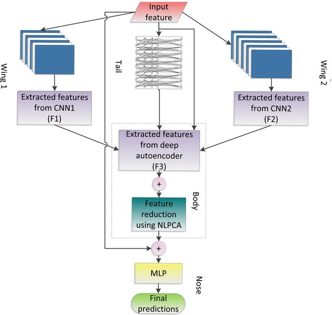

## References
<a href="https://arxiv.org/abs/2002.12592">Original Paper</a>

## Deep Ensemble Learning with Jet-Like architecture
1. <b>Tail</b>  > Sparse Autoencoder
2. <b>Wings</b> > Two CNNs
3. <b>Body</b> > Non-Linear PCA
4. <b>Nose</b> > MLP

## Architectural details

**CNN1 (Left Wing)**

	conv layers = 3
	fc layers = 1
	filter size = (1,4)
	input channels = 1
	output channels = 3
	stride = 1
	padding = none
	output features = 15

**CNN2 (Right Wing)**

	conv layers = 4
	fc layers = 1
	filter size = (1,3)
	input channels = 1
	output channels = 3
	stride = 1
	padding = none
	output features = 15

**Sparse AE (Tail)**

	linear layers = 8
	dropout = 0.1
	sparsity = 0.00005
	output features = 15

**NLPCA (Body)**

	input features = 108
	linear layers = 3
	output features = 15
	
**MLP (Nose)**

	linear layers = 3

